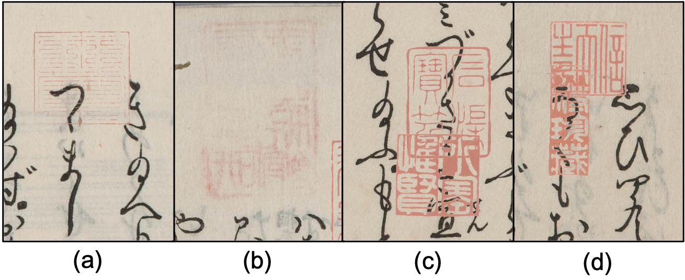
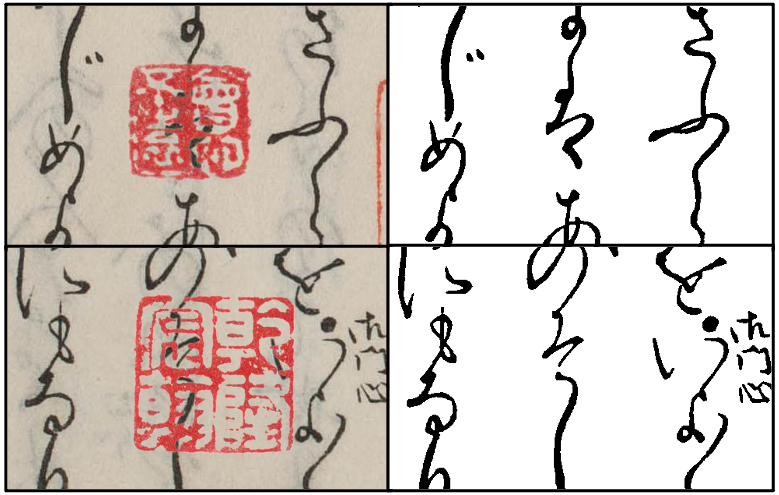

# Degraded Kuzushiji Documents with Seals (DKDS)
>[arXiv](https://arxiv.org/abs/2511.09117)
>[Project](https://ruiyangju.github.io/DKDS)

<p align="center">
  
</p>

# Tracks & Challenge
## Track 1: Text and Seal Detection
Text and seal detection serves as a crucial preliminary step for subsequent Kuzushiji OCR and seal analysis.
However, this task is challenging because seals may suffer from ink fading (left two) or overlap with Kuzushiji characters or other seals (right two), which often leads to reduced detection accuracy.

<p align="left">
  
</p>

You can download our dataset for **Track 1: Text and Seal Detection** from [here](https://1drv.ms/f/c/56c255dd1bb9ae9e/EtG5Wk7FIatCh5J0Y967n2oBNGj9DAMq_MdPyBO7gYq1FA?e=5SsERw).

## Track 2: Document Binarization
Document binarization aims to improve the accuracy of downstream OCR systems. In this task, the objective is to remove seals while preserving, or even restoring, Kuzushiji characters as much as possible. 
This process becomes particularly challenging when the Kuzushiji characters overlap with seals.

<p align="left">
  
</p>

You can download our dataset for **Track 2: Document Binarization** from [here](https://1drv.ms/f/c/56c255dd1bb9ae9e/Ekg5I9tnsJJNoVQJWfUO4aQBZ0AdgZ1wUbDBw3z_8FW5nw?e=qsezUG).

# Citation
If you find our paper useful in your research, please consider citing:
```
  @article{ju2025dkds,
    title={DKDS: A Benchmark Dataset of Degraded Kuzushiji Documents with Seals for Detection and Binarization},
    author={Ju, Rui-Yang and Yamashita, Kohei and Kameko, Hirotaka and Mori, Shinsuke},
    journal={arXiv preprint arXiv:2511.09117},
    year={2025}
  }
```

# Baseline Methods
## Environment
```
  conda create -n DKDS python=3.10
  pip install -r requirements.txt
```

## Seal Detection
### Baseline Performance
| Model     | Param.   | FLOPs    | AP<sub>50</sub><sup>Kuzushiji</sup> | AP<sub>50:95</sub><sup>Kuzushiji</sup> | AP<sub>50</sub><sup>Seal</sup> | AP<sub>50:95</sub><sup>Seal</sup> |
| :--:      | :-:      | :-:      | :-:                                  | :-:                                    | :-:                             | :-:                                |
| YOLOv8m   | 25.86M   | 79.1G    | 96.4%                                | 71.2%                                  | 99.1%                           | 86.2%                              |
| YOLOv9m   | 20.16M   | 77.5G    | 96.3%                                | 71.7%                                  | 97.2%                           | 81.4%                              |
| YOLOv10m  | 16.49M   | 64.0G    | 96.2%                                | 71.4%                                  | 99.1%                           | 85.7%                              |
| YOLOv11m  | 20.05M   | 68.2G    | 97.8%                                | 74.1%                                  | 98.5%                           | 85.7%                              |

### Train
We conducted training and validation of YOLO models using the [Ultralytics](https://github.com/ultralytics/ultralytics) YOLO framework.
The YOLO series of models are trained and evaluated using the following instructions:
```
  yolo detect train model=yolov8m.pt data=./meta.yaml epochs=100 batch=16 imgsz=640 device=0 workers=8 optimizer=SGD lr0=0.01 name=train_yolov8m
  yolo detect train model=yolov9m.pt data=./meta.yaml epochs=100 batch=16 imgsz=640 device=0 workers=8 optimizer=SGD lr0=0.01 name=train_yolov9m
  yolo detect train model=yolov10m.pt data=./meta.yaml epochs=100 batch=16 imgsz=640 device=0 workers=8 optimizer=SGD lr0=0.01 name=train_yolov10m
  yolo detect train model=yolo11m.pt data=./meta.yaml epochs=100 batch=16 imgsz=640 device=0 workers=8 optimizer=SGD lr0=0.01 name=train_yolo11m
```

### Test
### Pretrained Models
You can download our pretrained models [here](https://1drv.ms/f/c/56c255dd1bb9ae9e/Er-w8GewvF1OhD1NK-3zqD4BhF15-o4Bc9txTcz-IetBBA?e=RkJFgK).
Please revise the `/path/to/data` in `meta.yaml`.
```
  yolo val model=yolov8m.pt data=meta.yaml
  yolo val model=yolov9m.pt data=meta.yaml
  yolo val model=yolov10m.pt data=meta.yaml
  yolo val model=yolo11m.pt data=meta.yaml
```

## Document Binarization
### Baseline Performance
| Model | FM | p-FM | PSNR | DRD | Avg-Score |
| :--: | :-: | :-: | :-: | :-: | :-: |
| Niblack | 39.13 | 41.14 | 8.44dB | 79.70 | 27.25 |
| Otsu | 63.01 | 63.31 | 11.76dB | 37.69 | 50.10 |
| Sauvola | 87.87 | 90.99 | 18.34dB | 7.01 | 72.55 |
| K-means + Niblack | 39.99 | 42.03 | 8.61dB | 76.67 | 28.49 |
| K-means + Otsu | 84.76 | 86.28 | 17.14dB | 9.90 | 69.57 |
| K-means + Sauvola | 88.59 | 91.48 | 18.65dB | 6.37 | 73.09 |
| GAN | 98.11 | 98.14 | 26.53dB | 0.82 | 80.49 |

### Train
For traditional algorithms, please follow the instruction below:
```
  python ./algorithm/traditional.py
```
For k-means + traditional algorithms, please follow the instruction below:
```
  python ./algorithm/kmeans_traditional.py
```
For train the GAN model, please follow the instructions below:
```
  python ./GAN/image_to_512.py
  python ./GAN/gan_train.py
```

### Test
#### Pretrained Models
You can download our pretrained GAN-based models [here](https://1drv.ms/f/c/56c255dd1bb9ae9e/EvyWW4yx5e5OiqstmHWFXYMBe9z3Z3RwSB4bAMwcgkw_bg?e=3lGaP9).
Please place ``GAN_efficientnet-b5_50_0.00002`` in the ``./weights/`` folder before running ``gan_test.py``.
```
  python ./GAN/gan_test.py
```

# License
  

This benchmark dataset is licensed under a [Creative Commons Attribution-ShareAlike 4.0 International License (CC BY-SA 4.0)](https://creativecommons.org/licenses/by-sa/4.0/).

### Original Kuzushiji Dataset

The original Kuzushiji dataset used in this work is based on **『日本古典籍くずし字データセット』** (National Institute of Japanese Literature / CODH), provided by [ROIS-DS Center for Open Data in the Humanities (CODH)](https://codh.rois.ac.jp/), which is licensed under a [Creative Commons Attribution-ShareAlike 4.0 International License (CC BY-SA 4.0)](https://creativecommons.org/licenses/by-sa/4.0/).

The following is the citation of the original Kuzushiji dataset; please cite it when using our benchmark dataset:
```
  『日本古典籍くずし字データセット』 （国文研所蔵／CODH加工） doi:10.20676/00000340
```
