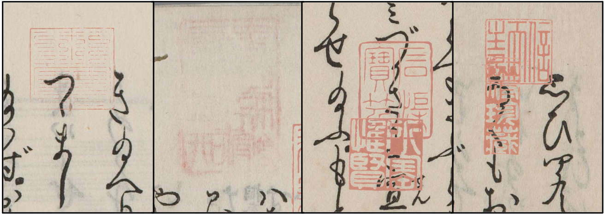

# Degraded Kuzushiji Documents with Seals (DKDS)
>[DKDS: A Benchmark Dataset of Degraded Kuzushiji Documents with Seals]()

## Teaser
<p align="center">
  
</p>

## Tracks & Challenge
### Track 1: Seal Detection
Seals may overlap with Kuzushiji characters (or other seals) and appear with faint ink, adversely affecting detection accuracy. 

You can download our dataset for Track 1: Seal Detection from [here](https://1drv.ms/f/c/56c255dd1bb9ae9e/EhOn3QlrciNLtCXkdwY2y5oBbcjT6zlbpUaA7Xuj-DkFfg?e=N3dXWE).
<p align="left">
  
</p>

### Track 2: Document Binarization
When seals overlap with Kuzushiji characters, removing the seals while preserving (or even restoring) the underlying characters poses a significant challenge.
<p align="left">
  
</p>

## Citation
If you find our paper useful in your research, please consider citing:
```
```

## Environment
```
  pip install -r requirements.txt
```

## Seal Detection
### Baseline Performance
| Model       | Param.   | FLOPs    | AP<sub>50</sub><sup>val</sup> | AP<sub>50-95</sub><sup>val</sup> | AP<sub>50</sub><sup>test</sup> | AP<sub>50-95</sub><sup>test</sup> |
| :--:       | :-:      | :-:      | :-:                            | :-:                               | :-:                            | :-:                                |
| YOLOv8m    | 25.86M   | 79.1G    | 99.5%                          | 92.4%                             | 97.9%                          | 87.9%                              |
| YOLOv9m    | 20.16M   | 77.5G    | 99.5%                          | 91.5%                             | 98.5%                          | 89.9%                              |
| YOLOv10m   | 16.49M   | 64.0G    | 99.5%                          | 91.8%                             | 97.0%                          | 89.0%                              |
| YOLO11m    | 20.05M   | 68.2G    | 99.5%                          | 96.4%                             | 98.7%                          | 89.6%                              |
| YOLOv8l    | 43.63M   | 165.4G   | 99.5%                          | 94.4%                             | 98.7%                          | 91.1%                              |
| YOLOv9c    | 25.53M   | 103.7G   | 99.5%                          | 93.9%                             | 98.0%                          | 89.2%                              |
| YOLOv10l   | 25.77M   | 127.2G   | 99.5%                          | 93.7%                             | 96.5%                          | 88.5%                              |
| YOLO11l    | 25.31M   | 87.3G    | 99.5%                          | 95.5%                             | 98.7%                          | 88.7%                              |

### Pretrained Models
You can download our pretrained models [here](https://1drv.ms/f/c/56c255dd1bb9ae9e/Er-w8GewvF1OhD1NK-3zqD4BhF15-o4Bc9txTcz-IetBBA?e=RkJFgK).

### Train & Val & Test
We conducted training, validation, and testing of YOLO models using the [Ultralytics](https://github.com/ultralytics/ultralytics) YOLO framework.
For instance, the YOLOv8m model was trained and evaluated using the following instructions:
```
  yolo detect train model=yolov8m.pt data=./meta.yaml epochs=100 batch=16 imgsz=640 device=0,1 workers=8 optimizer=SGD lr0=0.01 name=train_yolov8m
  yolo val model=./runs/detect/train_yolov8m/weights/best.pt data=./meta.yaml split=test imgsz=640 batch=16 conf=0.25 iou=0.6 device=0,1 workers=8 name=test_yolov8m
```

## Document Binarization
### Baseline Performance


### Pretrained Models
You can download our pretrained models [here]().

### Train & Evaluate
